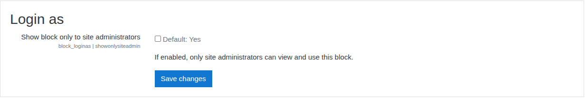

# Login as

A Moodle block plugin that provides a convenient option to log in as another user for users who have the "Log in as other users" capability.

## Requirements

- Moodle 3.9 or later
- PHP 7.2 or later

## Configuration
We can restrict the block visibility to site administrators only by setting "Show block only to site administrators" to Yes.

## License

This plugin is licensed under the [GNU GPL v3 or later](http://www.gnu.org/copyleft/gpl.html).

## Installation

Install by downloading a zip. Log in as an administrator and visit **Site administration → Plugins → Install plugin ** and upload the zip.

### Download the zip

1. Visit the Moodle plugins directory and download the version that matches your Moodle release:
   - <https://moodle.org/plugins/block_loginas>
2. Extract the zip.
3. Copy the extracted `loginas` folder into your Moodle `blocks` directory so the path becomes:
   - `moodle/blocks/loginas`
4. Log in as an administrator and visit **Site administration → Notifications**.
